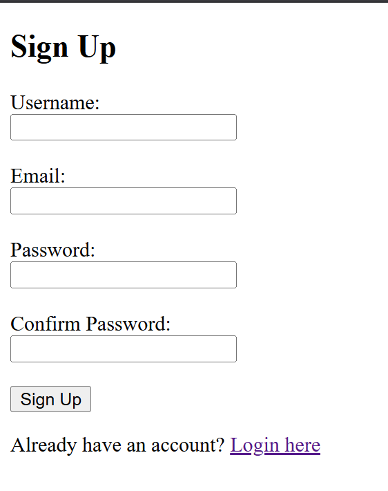
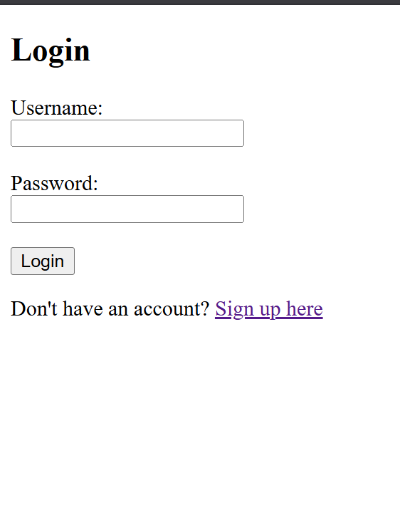
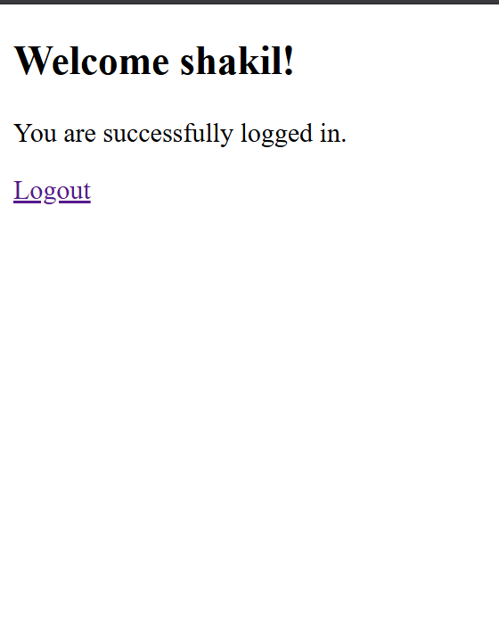

# 🚀 Django Login & Signup Authentication System

A complete, beginner-friendly Django authentication system with user registration, login, logout, and protected pages.


## 📋 Table of Contents

<details open>
<summary><b>🗂️ Quick Navigation</b></summary>

<table>
<tr>
<td width="50%" valign="top">

### 🎯 Getting Started
- [✨ Features](#features)
- [🎬 Demo](#demo)
- [🔧 Installation](#installation)
- [⚙️ Configuration](#configuration)

### 📘 Documentation
- [📖 Usage Guide](#usage)
- [📁 Project Structure](#project-structure)
- [🎓 Detailed Tutorial](#detailed-tutorial)
- [📚 API Endpoints](#api-endpoints)

</td>
<td width="50%" valign="top">

### 🛡️ Advanced Topics
- [🔒 Security Features](#security-features)
- [🐛 Troubleshooting](#troubleshooting)
- [🚀 Future Enhancements](#future-enhancements)
- [🛠️ Technologies Used](#technologies-used)

### 🤝 Community
- [🤝 Contributing](#contributing)
- [📄 License](#license)
- [👨‍💻 Author](#author)
- [📞 Support](#support)

</td>
</tr>
</table>

</details>

---

## ✨ Features

- **User Registration** - Create new accounts with username, email, and password
- **User Login** - Secure authentication with session management
- **User Logout** - Clean session termination
- **Protected Pages** - Access control using `@login_required` decorator
- **Password Hashing** - Secure password storage using PBKDF2
- **CSRF Protection** - Built-in Django CSRF token security
- **Flash Messages** - User-friendly success/error notifications
- **MySQL Database** - Reliable data persistence

## 🎯 Demo

<table>
<tr>
<td width="33%" align="center">

### 📝 Signup Page



Users can create a new account with validation for:
- ✅ Unique username
- ✅ Unique email
- ✅ Password confirmation

</td>
<td width="33%" align="center">

### 🔐 Login Page



Secure authentication with:
- ✅ Username/password validation
- ✅ Session creation
- ✅ Automatic redirection

</td>
<td width="33%" align="center">

### 🎉 Welcome Page



Protected dashboard showing:
- ✅ Personalized greeting
- ✅ User information
- ✅ Logout option

</td>
</tr>
</table>

## 🔧 Installation

### Prerequisites

- Python 3.x installed
- MySQL Server installed and running
- pip (Python package manager)

### Step 1: Clone the Repository

```bash
git clone https://github.com/yourusername/django-login-signup.git
cd django-login-signup
```

### Step 2: Create Virtual Environment (Recommended)

```bash
# Windows
python -m venv venv
venv\Scripts\activate

# macOS/Linux
python3 -m venv venv
source venv/bin/activate
```

### Step 3: Install Dependencies

```bash
pip install django mysqlclient
```

### Step 4: Create MySQL Database

```sql
CREATE DATABASE django_login_signup;
```

### Step 5: Configure Database Settings

Edit `login_signup_cld/settings.py`:

```python
DATABASES = {
    'default': {
        'ENGINE': 'django.db.backends.mysql',
        'NAME': 'django_login_signup',
        'USER': 'root',
        'PASSWORD': 'your_mysql_password',  # Update this
        'HOST': 'localhost',
        'PORT': '3306',
    }
}
```

### Step 6: Run Migrations

```bash
python manage.py makemigrations
python manage.py migrate
```

### Step 7: Create Superuser (Optional)

```bash
python manage.py createsuperuser
```

### Step 8: Run Development Server

```bash
python manage.py runserver
```

Visit: `http://localhost:8000/`

## ⚙️ Configuration

### Database Configuration

Update `settings.py` with your MySQL credentials:

```python
DATABASES = {
    'default': {
        'ENGINE': 'django.db.backends.mysql',
        'NAME': 'django_login_signup',
        'USER': 'your_username',
        'PASSWORD': 'your_password',
        'HOST': 'localhost',
        'PORT': '3306',
    }
}
```

### Installed Apps

The `accounts` app is included in `INSTALLED_APPS`:

```python
INSTALLED_APPS = [
    'django.contrib.admin',
    'django.contrib.auth',
    'django.contrib.contenttypes',
    'django.contrib.sessions',
    'django.contrib.messages',
    'django.contrib.staticfiles',
    'accounts',  # Our authentication app
]
```

## 📖 Usage

### Creating a New Account

1. Navigate to `http://localhost:8000/signup/`
2. Fill in the registration form:
   - Username (must be unique)
   - Email address (must be unique)
   - Password
   - Confirm password
3. Click "Sign Up"
4. Redirected to login page with success message

### Logging In

1. Navigate to `http://localhost:8000/login/`
2. Enter your username and password
3. Click "Login"
4. Redirected to welcome page

### Accessing Protected Pages

- Only logged-in users can access `/welcome/`
- Anonymous users are automatically redirected to login

### Logging Out

1. Click the "Logout" button on the welcome page
2. Session is destroyed
3. Redirected to login page

## 📁 Project Structure

```
login_signup_cld/
├── manage.py                    # Django management tool
├── tutorial.html               # Complete tutorial guide
├── README.md                   # This file
│
├── accounts/                   # Authentication app
│   ├── __init__.py
│   ├── admin.py
│   ├── apps.py
│   ├── models.py              # User model (Django's built-in)
│   ├── views.py               # Business logic
│   ├── urls.py                # App URL routing
│   ├── tests.py
│   ├── templates/
│   │   ├── signup.html       # Registration form
│   │   ├── login.html        # Login form
│   │   └── welcome.html      # Protected dashboard
│   └── migrations/            # Database migrations
│
└── login_signup_cld/           # Project configuration
    ├── __init__.py
    ├── settings.py           # Project settings
    ├── urls.py               # Main URL router
    ├── asgi.py
    └── wsgi.py
```

## 📚 Detailed Tutorial

### 🎓 Complete Beginner's Guide Available!

This project includes an **extensive, step-by-step tutorial** that explains every concept in detail. Open the `tutorial.html` file in your browser for:

- **Complete authentication flow diagrams**
- **Line-by-line code explanations**
- **How each view function works**
- **Database and session management**
- **Security concepts explained**
- **Common mistakes to avoid**
- **Real-world user journey examples**

**To access the tutorial:**

1. Open `tutorial.html` in any web browser
2. Or visit it at `http://localhost:8000/tutorial.html` after starting the server

The tutorial covers:
- Project structure and setup
- URL routing mechanics
- Signup process (complete flow)
- Login and authentication
- Session management
- Protected pages with decorators
- Logout functionality
- Security best practices
- Django messages framework
- And much more!

## 🔒 Security Features

### 1. Password Hashing
- Uses PBKDF2 algorithm with SHA256
- Passwords are never stored in plain text
- One-way hashing prevents password recovery

### 2. CSRF Protection
- Django's built-in CSRF tokens
- Prevents cross-site request forgery attacks
- Required in all POST forms

### 3. Session Security
- HttpOnly cookies (JavaScript cannot access)
- Secure session IDs
- Configurable session expiry

### 4. SQL Injection Prevention
- Django ORM parameterized queries
- Automatic input sanitization
- No raw SQL vulnerabilities

### 5. Access Control
- `@login_required` decorator
- Automatic redirection for unauthorized access
- Session validation on every request

## 🛠️ Technologies Used

- **Backend:** Django 5.2.7
- **Database:** MySQL
- **Language:** Python 3.x
- **Authentication:** Django's built-in auth system
- **Frontend:** HTML5, CSS3

## 📝 API Endpoints

| Endpoint | Method | Description | Authentication |
|----------|--------|-------------|----------------|
| `/` | GET | Signup page | No |
| `/signup/` | GET/POST | User registration | No |
| `/login/` | GET/POST | User login | No |
| `/welcome/` | GET | Protected dashboard | Required |
| `/logout/` | GET | User logout | Required |

## 🐛 Troubleshooting

### Database Connection Error

```bash
django.db.utils.OperationalError: (2003, "Can't connect to MySQL server")
```

**Solution:** Ensure MySQL is running and credentials in `settings.py` are correct.

### Template Not Found

```bash
TemplateDoesNotExist at /signup/
```

**Solution:** Check that `accounts` is in `INSTALLED_APPS` and templates are in `accounts/templates/`.

### CSRF Token Missing

```bash
Forbidden (403): CSRF verification failed
```

**Solution:** Add `` inside all POST forms.

## 🚀 Future Enhancements

- [ ] Email verification for new accounts
- [ ] Password reset functionality
- [ ] Social authentication (Google, Facebook)
- [ ] Two-factor authentication (2FA)
- [ ] User profile pages
- [ ] Remember me functionality
- [ ] Account activation via email
- [ ] Password strength validator
- [ ] Rate limiting for login attempts

## 🤝 Contributing

Contributions are welcome! Please feel free to submit a Pull Request.

1. Fork the project
2. Create your feature branch (`git checkout -b feature/AmazingFeature`)
3. Commit your changes (`git commit -m 'Add some AmazingFeature'`)
4. Push to the branch (`git push origin feature/AmazingFeature`)
5. Open a Pull Request

## 📄 License

This project is licensed under the MIT License - see the LICENSE file for details.

## 👨‍💻 Author

**MD. SHAKIL MIA**
- Email: shakilahmed4024@gmail.com

## 🙏 Acknowledgments

- Django Documentation
- Django Authentication System
- MySQL Database
- All contributors and learners

## 📞 Support

If you have any questions or need help, please:
1. Check the `tutorial.html` file for detailed explanations
2. Open an issue on GitHub
3. Contact the author

---

⭐ If you found this project helpful, please give it a star!

**Happy Coding! 🎉**
